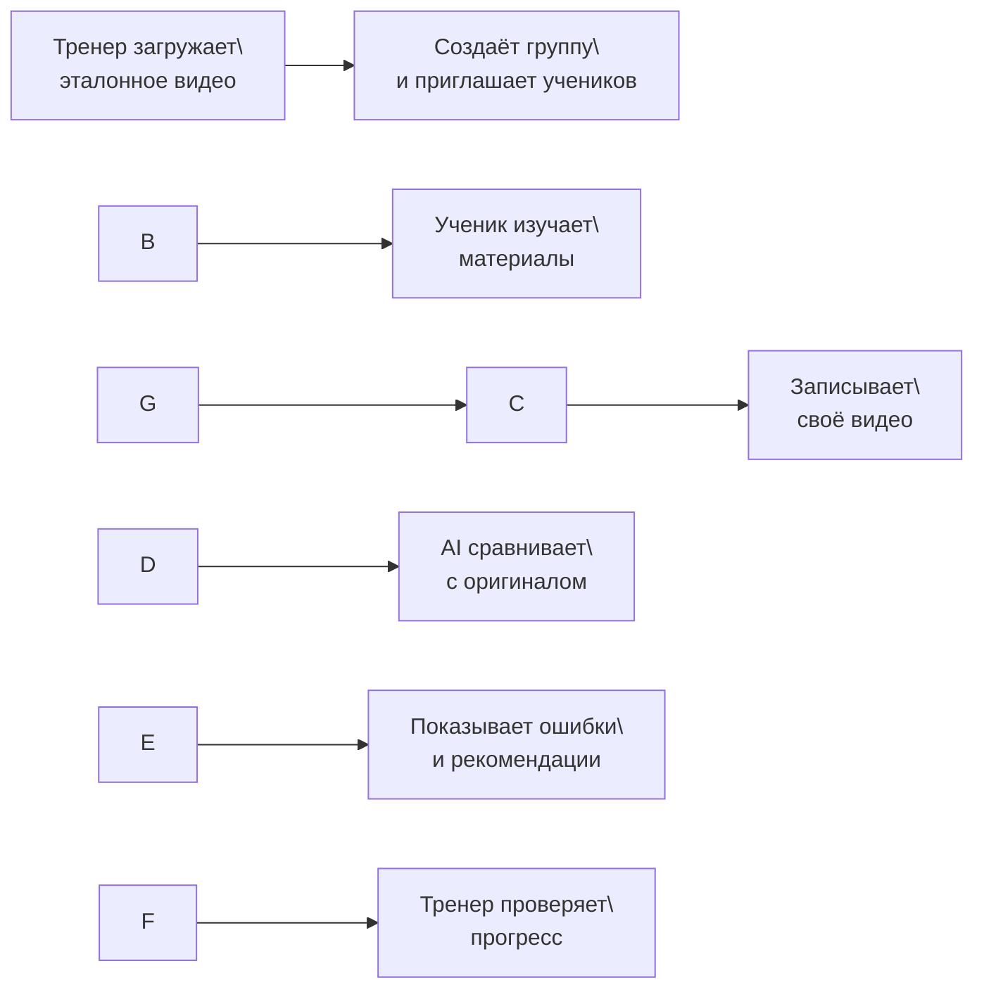
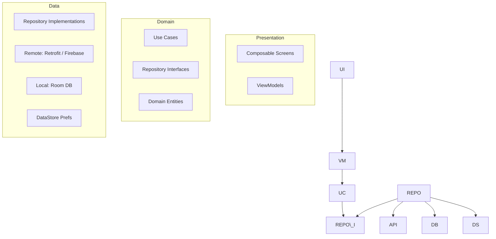
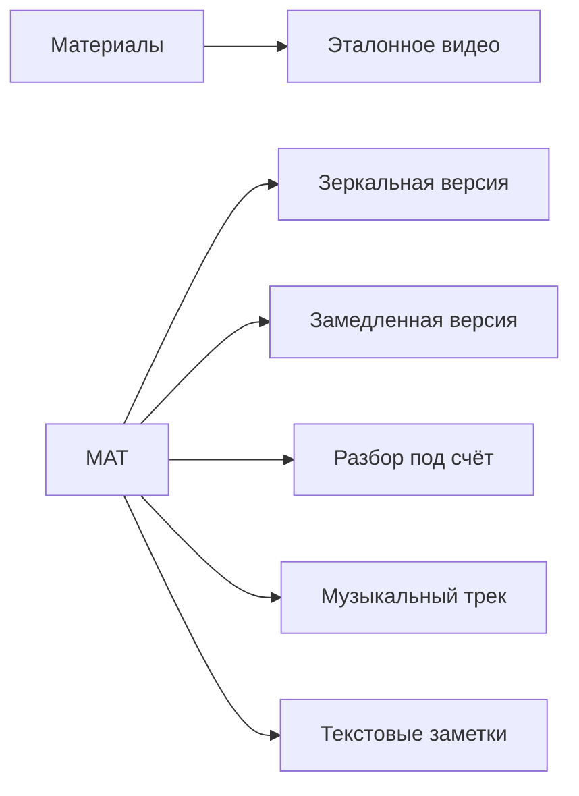
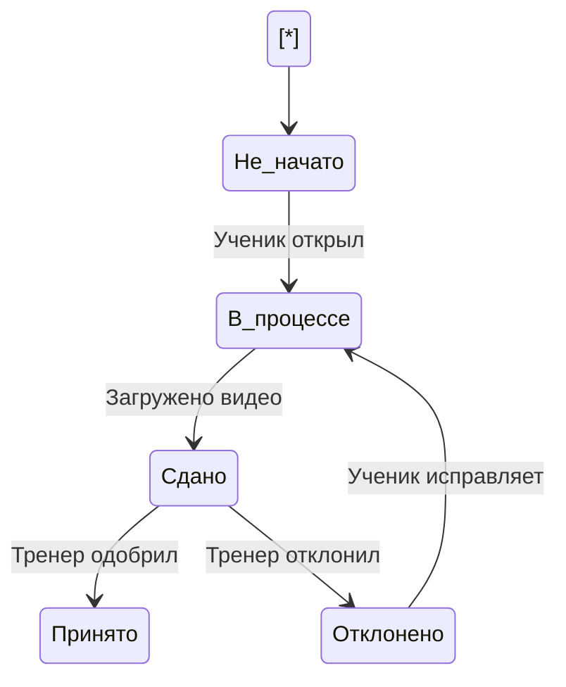
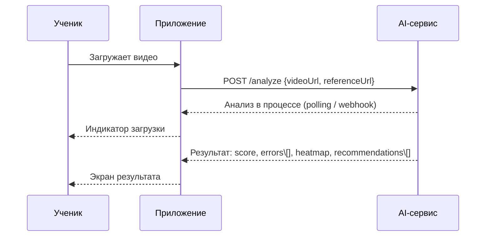
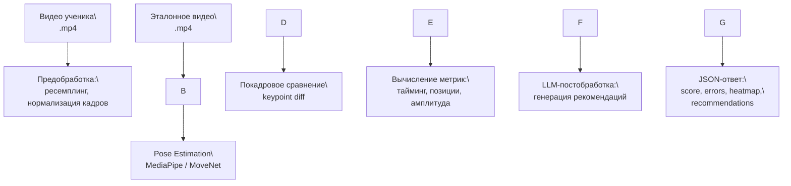
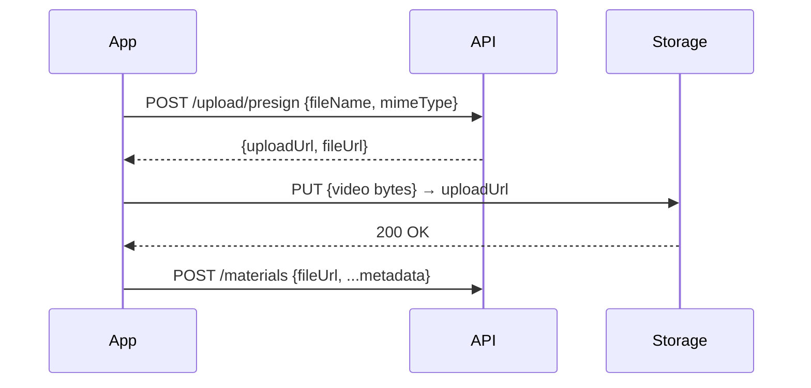

# Техническое задание на разработку Android-приложения **MOVI**

\---

|Поле|Значение|
|-|-|
|Документ|Техническое задание|
|Версия|1.0|
|Статус|Черновик|
|Дата|2025|
|Ссылка на дизайн|[Figma – MOVI](https://www.figma.com/design/AMcptffPoFVTW41xpDVUYX/MOVI?node-id=0-1&t=aZQo0mQCLpn5su4p-1)|
|Платформа|Android (min SDK 26 / Android 8.0+)|
|Стек|Kotlin, Jetpack Compose, MVVM + Clean Architecture|

\---

## Содержание

1. [Общие сведения и назначение](#1-общие-сведения)
2. [Целевая аудитория](#2-целевая-аудитория)
3. [Роли пользователей](#3-роли-пользователей)
4. [Общая архитектура приложения](#4-общая-архитектура)
5. [Навигация и структура экранов](#5-навигация)
6. [Функциональные требования по модулям](#6-функциональные-требования)

   * 6.1 Главная (Dashboard)
   * 6.2 Группы
   * 6.3 Практика и AI-анализ
   * 6.4 Чаты
   * 6.5 Профиль
7. [Требования к AI-модулю](#7-ai-модуль)
8. [Нефункциональные требования](#8-нефункциональные-требования)
9. [Технический стек](#9-технический-стек)
10. [Модель данных (сущности)](#10-модель-данных)
11. [API и интеграции](#11-api-и-интеграции)
12. [Безопасность](#12-безопасность)
13. [Глоссарий](#13-глоссарий)

\---

## 1\. Общие сведения

### 1.1 Назначение

**MOVI** — мобильное Android-приложение для тренеров, танцоров и cover dance-команд. Платформа объединяет инструменты управления группами, хранилище хореографического контента и AI-движок для автоматического анализа исполнения танца в сравнении с эталоном.

Ключевая ценность: «**Duolingo + Notion + TikTok + AI-анализ для танцев**».

### 1.2 Концепция рабочего процесса



\---

## 2\. Целевая аудитория

|Сегмент|Описание|
|-|-|
|Тренеры / хореографы|Ведут группы, загружают контент, контролируют прогресс|
|Ученики / танцоры|Изучают хореографию, практикуются, получают AI-обратную связь|
|Cover dance-команды|Командная работа над постановкой|

\---

## 3\. Роли пользователей

### 3.1 Тренер

|Действие|Описание|
|-|-|
|Создание группы|Задаёт название, описание, обложку, приглашает участников|
|Загрузка материалов|Эталонное видео, зеркальная и замедленная версии, нотации под счёт|
|Постановка заданий|Задачи с дедлайнами и статусами для учеников|
|Проверка сдач|Просмотр видеозаписей учеников, ручная и AI-оценка|
|Коммуникация|Групповой чат, личные сообщения|
|Аналитика|Сводные AI-отчёты, статистика посещаемости, прогресс учеников|

### 3.2 Ученик

|Действие|Описание|
|-|-|
|Вход в группу|По ссылке-приглашению или коду|
|Просмотр материалов|Видео, заметки, музыка|
|Практика с AI|Запись себя → AI-сравнение → разбор ошибок|
|Сдача задания|Загрузка видео тренеру|
|Коммуникация|Чат с тренером и командой|
|Личная статистика|История практик, прогресс, достижения|

\---

## 4\. Общая архитектура

### 4.1 Архитектурный паттерн

Приложение строится по принципу **Clean Architecture** с разделением на слои:



### 4.2 Слои и ответственности

|Слой|Технология|Ответственность|
|-|-|-|
|UI|Jetpack Compose|Рендеринг экранов, обработка событий|
|ViewModel|Hilt + ViewModel|Состояние экрана, бизнес-логика представления|
|Use Cases|Kotlin|Изолированные сценарии использования|
|Repository|Interface + Impl|Источник данных (remote / local)|
|Remote Data|Retrofit + Firebase|REST API, хранилище медиа, пуши|
|Local Data|Room + DataStore|Офлайн-кэш, настройки|

\---

## 5\. Навигация

### 5.1 Bottom Navigation Bar (5 вкладок)

|#|Вкладка|Иконка|Описание|
|-|-|-|-|
|1|Главная|Home|Dashboard пользователя|
|2|Группы|Groups|Список групп и классы|
|3|Практика|Play|AI-зал самостоятельной практики|
|4|Чаты|Chat|Личные, групповые, AI-чат|
|5|Профиль|Person|Статистика, достижения, настройки|

### 5.2 Граф навигации (верхний уровень)

```mermaid
flowchart TD
    ROOT(\[Splash / Onboarding])
    ROOT --> AUTH{Авторизован?}
    AUTH -- Нет --> LOGIN\[Экран входа / регистрации]
    AUTH -- Да --> NAV\[Bottom Navigation]

    NAV --> HOME\[Главная]
    NAV --> GROUPS\[Группы]
    NAV --> PRACTICE\[Практика]
    NAV --> CHATS\[Чаты]
    NAV --> PROFILE\[Профиль]

    GROUPS --> GROUP\_DETAIL\[Группа — детальный экран]
    GROUP\_DETAIL --> TAB\_MATERIALS\[Вкладка: Материалы]
    GROUP\_DETAIL --> TAB\_TASKS\[Вкладка: Задания]
    GROUP\_DETAIL --> TAB\_MEMBERS\[Вкладка: Участники]
    GROUP\_DETAIL --> TAB\_CHAT\[Вкладка: Чат]

    PRACTICE --> PRACTICE\_SESSION\[Сессия записи]
    PRACTICE\_SESSION --> AI\_RESULT\[Результат AI-анализа]
    AI\_RESULT --> ERRORS\_DETAIL\[Экран ошибок]

    CHATS --> PERSONAL\_CHAT\[Личный чат]
    CHATS --> GROUP\_CHAT\[Групповой чат]
    CHATS --> AI\_CHAT\[AI-ассистент]
```

\---

## 6\. Функциональные требования

### 6.1 Главная (Dashboard)

#### 6.1.1 Ученик — Dashboard

|Блок|Содержимое|Действия|
|-|-|-|
|Сегодня|Ближайшие задания с дедлайнами|Открыть задание|
|Новое от тренера|Новые видео и комментарии|Смотреть урок|
|AI рекомендует|Персональные советы на основе анализа|—|
|Мой прогресс|Процент освоения текущего танца|Продолжить практику|

**Кнопки экрана:** «Смотреть урок», «Загрузить видео», «Продолжить практику».

#### 6.1.2 Тренер — Dashboard

|Блок|Содержимое|Действия|
|-|-|-|
|Активные группы|Краткие карточки групп|Войти в группу|
|Новые сдачи|Список видео от учеников|Проверить сдачи|
|AI-отчёты|Сводный прогресс групп|Открыть отчёт|
|Уведомления|Новые сообщения, запросы|—|

**Кнопки экрана:** «Создать группу», «Загрузить хореографию», «Проверить сдачи».

\---

### 6.2 Модуль «Группы»

#### 6.2.1 Список групп

Карточка группы содержит: название, имя тренера, количество участников, текущий танец, общий прогресс группы.

**Действия:** «Войти», «Создать группу» (только тренер).

#### 6.2.2 Экран группы — 4 вкладки

##### Вкладка «Материалы»



Карточка материала: превью видео, название, длительность, комментарий тренера.
Действия: «Смотреть», «Скачать», «Добавить в избранное».

##### Вкладка «Задания»

|Поле|Описание|
|-|-|
|Название|Например: «Сдать Chorus до пятницы»|
|Описание|Детали задания|
|Дедлайн|Дата и время|
|Статус|Не начато / В процессе / Сдано / Принято / Отклонено|

Действия: «Открыть», «Сдать видео».

**Жизненный цикл задания:**



##### Вкладка «Участники»

Список участников: аватар, имя, уровень, прогресс, посещаемость.
Для тренера доступны: профиль ученика, история сдач, AI-прогресс, слабые места.

##### Вкладка «Чат»

|Функция|Поддержка|
|-|-|
|Текстовые сообщения|✅|
|Голосовые сообщения|✅|
|Отправка видео|✅|
|Реакции (emoji)|✅|
|Закреплённые сообщения|✅|

\---

### 6.3 Модуль «Практика» (AI-зал)

Центральный модуль приложения. Позволяет ученику записать себя на камеру и получить автоматический AI-разбор по сравнению с эталоном.

#### 6.3.1 Экран сессии записи

Экран делится на 2 области:

* **Область A** (сверху / слева) — эталонное видео тренера, воспроизводится синхронно.
* **Область B** (снизу / справа) — предпросмотр с камеры ученика.

Управление: «Начать запись», «Пауза», «Остановить», «Пересдать».

#### 6.3.2 Процесс AI-анализа



#### 6.3.3 Метрики AI-анализа

|Метрика|Описание|Пример вывода|
|-|-|-|
|Тайминг|Попадание в ритм музыки|«Тайминг: 82%. Запоздание на 0:21 (+0.4 сек)»|
|Позиции тела|Руки, ноги, корпус, голова|«Левая рука слишком низко на 0:34»|
|Амплитуда|Степень «дотянутости» движений|«Недостаточный мах рукой в Chorus»|
|Энергия / подача|Резкость, уверенность, динамика|«Низкая энергия в секции 0:50–1:10»|

#### 6.3.4 Экран результата AI-анализа

* Общий балл (например, **78 / 100**)
* Heatmap ошибок по частям тела
* Таймлайн ошибок (например: 0:12 – правая рука, 0:26 – опоздание)
* Текстовые рекомендации

**Кнопки:** «Пересдать», «Посмотреть ошибки», «Отправить тренеру».

#### 6.3.5 Экран ошибок (детальный разбор)

При тапе на временную метку на таймлайне:

* стоп-кадр ученика рядом со стоп-кадром эталона,
* текстовое описание ошибки,
* рекомендация по исправлению.

**Кнопки:** «Повторить этот момент», «Замедлить», «Посмотреть эталон».

\---

### 6.4 Модуль «Чаты»

|Тип чата|Описание|
|-|-|
|Личный чат|Ученик ↔ Тренер, один-на-один|
|Групповой чат|Все участники группы|
|AI-ассистент|Диалог с AI-тренером|

#### AI-ассистент (чат-бот)

Ученик может задавать вопросы в свободной форме:

* «Что я делаю не так в повороте?»
* «Как лучше сделать wave?»
* «Объясни технику этого движения»

AI отвечает как персональный мини-тренер: текст + возможность прикрепить видео-фрагмент для анализа.

\---

### 6.5 Модуль «Профиль»

#### Профиль ученика

|Блок|Содержимое|
|-|-|
|Базовая информация|Имя, аватар, уровень, стиль танца|
|Команды|Список групп|
|Мой прогресс|Общая статистика по практикам|
|Мои танцы|История разученных постановок|
|AI-статистика|Динамика метрик (тайминг, позиции, амплитуда)|
|Слабые зоны|Зоны тела с повторяющимися ошибками|
|Достижения|Бейджи и награды|

#### Профиль тренера

|Блок|Содержимое|
|-|-|
|Базовая информация|Имя, аватар, специализация|
|Мои группы|Сводка по группам|
|Ученики|Общее число, активные|
|Статистика|Средний прогресс учеников|

\---

## 7\. AI-модуль

### 7.1 Архитектура AI-пайплайна



### 7.2 Входные / выходные данные AI-сервиса

**Запрос:**

```json
{
  "student\_video\_url": "https://...",
  "reference\_video\_url": "https://...",
  "segment": { "start\_sec": 0, "end\_sec": 60 }
}
```

**Ответ:**

```json
{
  "score": 78,
  "metrics": {
    "timing": 82,
    "body\_positions": 74,
    "amplitude": 76,
    "energy": 80
  },
  "errors": \[
    {
      "time\_sec": 12.4,
      "body\_part": "right\_arm",
      "description": "Правая рука слишком низко",
      "recommendation": "Поднять руку до уровня плеча"
    }
  ],
  "heatmap": { "right\_arm": 0.7, "left\_leg": 0.4, "torso": 0.2 },
  "recommendations": \[
    "Поработай над таймингом в секции 0:20–0:30",
    "Увеличь амплитуду взмаха руками"
  ]
}
```

\---

## 8\. Нефункциональные требования

### 8.1 Производительность

|Показатель|Требование|
|-|-|
|Запуск приложения (cold start)|≤ 3 секунды|
|Загрузка списков (групп, заданий)|≤ 1.5 секунды|
|Начало воспроизведения видео|≤ 2 секунды|
|Время AI-анализа (серверная сторона)|≤ 60 секунд на минуту видео|
|Плавность UI|60 fps в Compose-анимациях|

### 8.2 Доступность (Offline)

|Функция|Офлайн-поддержка|
|-|-|
|Просмотр скачанных материалов|✅|
|История практик|✅ (локальный кэш Room)|
|Загрузка видео и AI-анализ|❌ (требует сеть)|
|Чаты|❌ (требует сеть)|

### 8.3 Поддерживаемые версии Android

|Параметр|Значение|
|-|-|
|Минимальный SDK|26 (Android 8.0 Oreo)|
|Целевой SDK|34 (Android 14)|
|Рекомендуемый SDK|33+|

### 8.4 Разрешения устройства

|Разрешение|Назначение|
|-|-|
|`CAMERA`|Запись видео в практике|
|`RECORD\_AUDIO`|Голосовые сообщения, запись|
|`READ\_MEDIA\_VIDEO`|Загрузка видео из галереи|
|`INTERNET`|Все сетевые операции|
|`POST\_NOTIFICATIONS`|Push-уведомления|

\---

## 9\. Технический стек

### 9.1 Frontend (Android)

|Категория|Библиотека / Инструмент|
|-|-|
|Язык|Kotlin 1.9+|
|UI-фреймворк|Jetpack Compose (Material 3)|
|Навигация|Navigation Compose|
|DI|Hilt (Dagger)|
|Async|Kotlin Coroutines + Flow|
|Сеть|Retrofit 2 + OkHttp + kotlinx.serialization|
|Медиа-плеер|ExoPlayer (Media3)|
|Камера|CameraX|
|Изображения|Coil|
|Локальная БД|Room|
|Настройки|DataStore Preferences|
|Push-уведомления|Firebase Cloud Messaging (FCM)|
|Аналитика|Firebase Analytics|
|Краши|Firebase Crashlytics|

### 9.2 Backend (рекомендуемый стек)

|Категория|Технология|
|-|-|
|API|REST + WebSocket|
|Аутентификация|Firebase Auth / JWT|
|Хранилище видео|Firebase Storage / S3-compatible|
|База данных|PostgreSQL / Firestore|
|AI-сервис|Python (FastAPI) + MediaPipe + LLM API|
|Push|Firebase Cloud Messaging|

\---

## 10\. Модель данных (сущности)

### 10.1 User

|Поле|Тип|Описание|
|-|-|-|
|`id`|String (UUID)|Уникальный идентификатор|
|`name`|String|Отображаемое имя|
|`avatarUrl`|String?|URL аватара|
|`role`|Enum: TRAINER / STUDENT|Роль пользователя|
|`level`|String?|Танцевальный уровень|
|`danceStyle`|String?|Стиль (K-pop, Hip-hop и т.д.)|
|`createdAt`|Timestamp|Дата регистрации|

### 10.2 Group

|Поле|Тип|Описание|
|-|-|-|
|`id`|String|Идентификатор группы|
|`name`|String|Название|
|`coverUrl`|String?|URL обложки|
|`description`|String?|Описание|
|`trainerId`|String|ID тренера (FK → User)|
|`currentDance`|String?|Текущая постановка|
|`memberCount`|Int|Количество участников|
|`progress`|Float|Средний прогресс группы (0–1)|

### 10.3 Material

|Поле|Тип|Описание|
|-|-|-|
|`id`|String|Идентификатор|
|`groupId`|String|FK → Group|
|`type`|Enum: VIDEO / AUDIO / TEXT|Тип контента|
|`subtype`|Enum: REFERENCE / MIRROR / SLOW / NOTES|Подтип видео|
|`videoUrl`|String?|URL видео|
|`title`|String|Название|
|`durationSec`|Int?|Длительность в секундах|
|`trainerComment`|String?|Комментарий тренера|
|`createdAt`|Timestamp|Дата загрузки|

### 10.4 Task

|Поле|Тип|Описание|
|-|-|-|
|`id`|String|Идентификатор|
|`groupId`|String|FK → Group|
|`title`|String|Название задания|
|`description`|String?|Описание|
|`deadline`|Timestamp|Дедлайн|
|`status`|Enum: PENDING / IN\_PROGRESS / SUBMITTED / ACCEPTED / REJECTED|Статус|
|`assignedTo`|String|FK → User (ученик)|

### 10.5 PracticeSession

|Поле|Тип|Описание|
|-|-|-|
|`id`|String|Идентификатор|
|`userId`|String|FK → User (ученик)|
|`referenceVideoId`|String|FK → Material|
|`studentVideoUrl`|String|URL видео ученика|
|`score`|Int?|Общий балл 0–100|
|`timingScore`|Int?|Тайминг|
|`positionScore`|Int?|Позиции|
|`amplitudeScore`|Int?|Амплитуда|
|`energyScore`|Int?|Энергия|
|`errors`|JSON|Список ошибок с метками времени|
|`heatmap`|JSON|Тепловая карта ошибок|
|`recommendations`|JSON|Текстовые рекомендации|
|`createdAt`|Timestamp|Дата сессии|

### 10.6 ChatMessage

|Поле|Тип|Описание|
|-|-|-|
|`id`|String|Идентификатор|
|`chatId`|String|ID чата (группа или личный)|
|`senderId`|String|FK → User|
|`type`|Enum: TEXT / VOICE / VIDEO / AI\_RESPONSE|Тип сообщения|
|`content`|String?|Текст|
|`mediaUrl`|String?|URL медиа|
|`isPinned`|Boolean|Закреплено|
|`reactions`|JSON|Реакции пользователей|
|`sentAt`|Timestamp|Время отправки|

\---

## 11\. API и интеграции

### 11.1 Ключевые эндпоинты

|Метод|Endpoint|Описание|
|-|-|-|
|POST|`/auth/register`|Регистрация|
|POST|`/auth/login`|Вход|
|GET|`/groups`|Список групп пользователя|
|POST|`/groups`|Создать группу|
|GET|`/groups/{id}/materials`|Материалы группы|
|POST|`/groups/{id}/materials`|Загрузить материал|
|GET|`/groups/{id}/tasks`|Задания группы|
|POST|`/tasks/{id}/submit`|Сдать видео|
|POST|`/practice/analyze`|Запустить AI-анализ|
|GET|`/practice/sessions/{id}`|Результат анализа|
|GET|`/chats/{id}/messages`|История чата|
|POST|`/chats/{id}/messages`|Отправить сообщение|
|POST|`/ai/chat`|Сообщение AI-ассистенту|

### 11.2 Загрузка видео

Видео загружаются напрямую в Firebase Storage / S3 через presigned URL для снижения нагрузки на API-сервер.



\---

## 12\. Безопасность

|Требование|Реализация|
|-|-|
|Аутентификация|Firebase Auth (email/password, Google OAuth) + JWT-токены|
|Хранение токенов|Android Keystore + EncryptedSharedPreferences|
|HTTPS|TLS 1.2+ обязателен для всех запросов|
|Разграничение ролей|Серверная валидация роли на каждом защищённом эндпоинте|
|Приватность видео|Доступ по presigned URL с временным токеном (TTL ≤ 1 час)|
|Данные учеников|Шифрование PII полей в БД|

\---

## 13\. Глоссарий

|Термин|Определение|
|-|-|
|Эталонное видео|Видео тренера или айдола, которое ученик должен повторить|
|AI-анализ|Автоматическое покадровое сравнение видео ученика и эталона|
|Heatmap|Визуальная карта частей тела с отмеченными зонами ошибок|
|Cover dance|Воспроизведение хореографии известного исполнителя|
|PracticeSession|Одна попытка записи ученика с результатами AI-анализа|
|Keypoint|Ключевая точка тела (нос, плечо, локоть, запястье и т.д.), определяемая моделью позы|
|Score|Итоговый балл от 0 до 100, отражающий качество исполнения|
|Bottom Navigation|Нижняя панель навигации с 5 основными разделами приложения|

\---

*Документ составлен на основе концепции приложения MOVI и дизайна Figma. Требует согласования с командой разработки и дополнения детальными мокапами по каждому экрану.*

